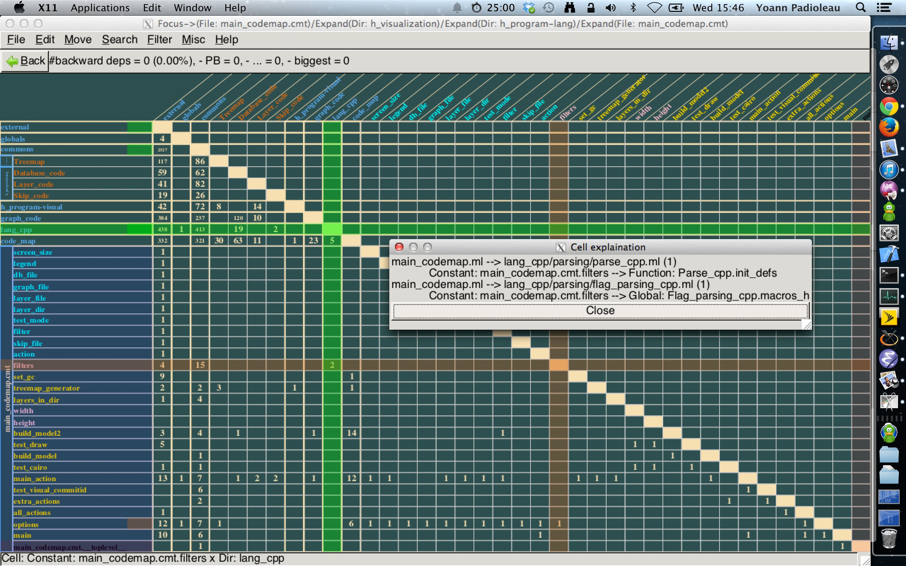

# Codegraph

Hierarchical dependency analyzer and visualizer using a
[Dependency Structure Matrix](http://en.wikipedia.org/wiki/Design_structure_matrix)
(DSM). Builds dependency graphs from source code at multiple granularities
(packages, modules, types, functions) and renders them via a GTK2/Cairo GUI.
Uses [semgrep](https://github.com/semgrep/semgrep) parsers for
multi-language support.



Understanding dependencies is at the essence of software architecture:
code is a tree when looked at locally (AST), but it's really a graph
of dependencies when looked at globally. Codegraph helps you understand
and improve that structure.

A great introduction to DSM for improving a codebase:
http://codebetter.com/patricksmacchia/2009/08/24/identify-code-structure-patterns-at-a-glance/

### Related tools

Other tools using DSM for software architecture analysis:
- [NDepend](https://www.ndepend.com/docs/dependency-structure-matrix-dsm) (.NET)
- [Lattix](https://dsmweb.org/lattix/) (multi-language, enterprise)
- [Structure101](http://www.headwaysoftware.com/products/index.php#page-top) (Java)
- [IntelliJ IDEA DSM](http://blogs.jetbrains.com/idea/2008/01/intellij-idea-dependency-analysis-with-dsm/) (Java/Kotlin)

See also the [old codegraph page at Facebook](https://github.com/facebookarchive/pfff/wiki/CodeGraph)
for more information.

## Building

### Prerequisites

OCaml 4.14+ (via opam >= 2.1), gcc, git, curl, pkg-config.

On Ubuntu/Debian:
```bash
apt-get install build-essential pkg-config opam curl libcairo2-dev libgtk2.0-dev
```

On macOS:
```bash
brew install opam pkg-config cairo gtk+
```

C libraries (pcre, pcre2, gmp, libev, libcurl) are installed automatically
by `./configure` via opam — no need to install them manually.

### Quick start

```bash
git clone --recurse-submodules https://github.com/aryx/codegraph
cd codegraph
./configure     # installs opam deps and sets up tree-sitter (run infrequently)
make            # routine build
make test       # run tests
```

### Docker

A reference build using Ubuntu is provided:

```bash
docker build -t codegraph .
```

To build with OCaml 5:
```bash
docker build -t codegraph --build-arg OCAML_VERSION=5.2.1 .
```

## Usage

### `codegraph_build`

```bash
codegraph_build -lang cmt ~/my-project
```

Generates a `graph_code.marshall` file in `~/my-project` containing
all dependency information, using the typed bytecode `.cmt` files
generated during compilation.

### `codegraph`

```bash
codegraph ~/my-project
```

Launches a GTK-based GUI that lets you visualize source code
dependencies as a DSM. You can interactively expand/collapse nodes
to navigate between different granularities (packages, modules,
functions) and zoom into specific dependencies to see the actual
code entities involved.

You can also run codegraph from a subdirectory to get a focused
slice of the dependency graph:

```bash
codegraph ~/my-project/src/core
```
